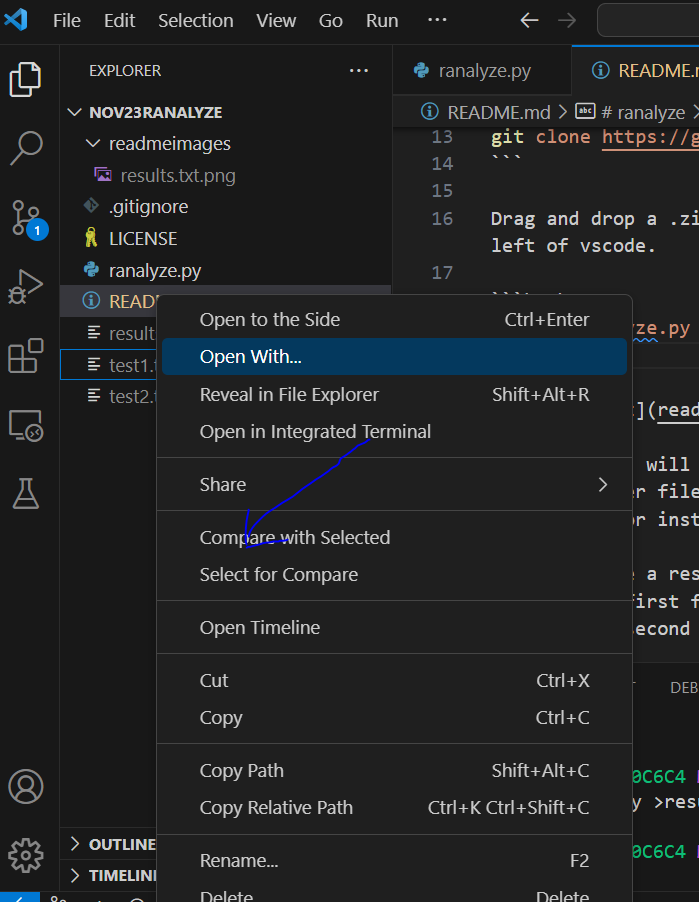
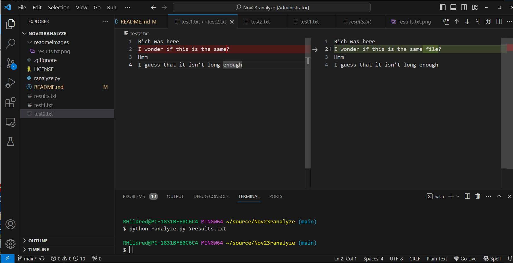

# ranalyze
recursively compare every file with every other file and give the probability that they had a common ancestor

## Prerequisites

Note 1: I made a video of installing the prerequisites [here](https://youtu.be/AjB2SiGlJ20).

1. vscode
2. python
3. git

Note 2: I made a video of using ranalyze [here](https://youtu.be/5ANEoaO1H8o).

To use, open a fresh folder in vscode and open a new terminal

```bash
git clone https://github.com/rhildred/ranalyze.git .
```

Drag and drop a .zip of the files you want to check for common ancestry in to the explorer pane on the left of vscode.

```bash
python ranalyze.py > results.txt
```


`results.txt` will have the probabilities expressed as a percentage that a file had a common ancestor with any other file in the set. Edit this file to remove any common ancestors that can be easily explained. For instance some students will submit assignments more than once.

When you have a results.txt that consists of files that need a closer looking at.
1. find the first file, right click and do "select for compare"
2. find the second file, right click and do "compare with selected"



The files will appear side by side. The differences will be color coded. The user of ranalyze.py decides, based on the diffs, whether 2 files truly came from the same ancestor.



ranalyze is meant as a tool to highlight files that need further interpretation. Examining the diff is the only way to know if files truly had the same ancestor.
